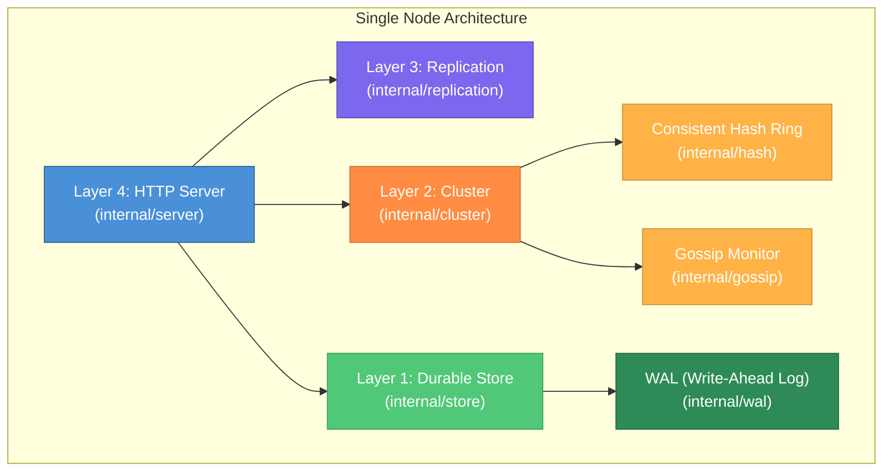
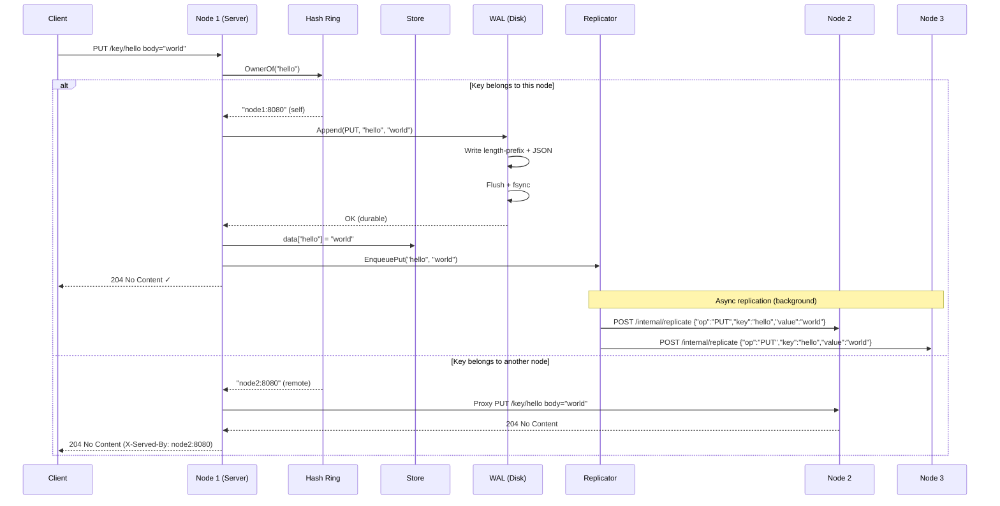
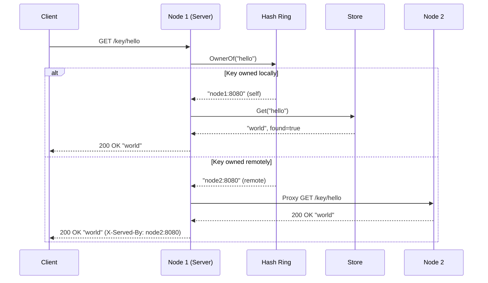
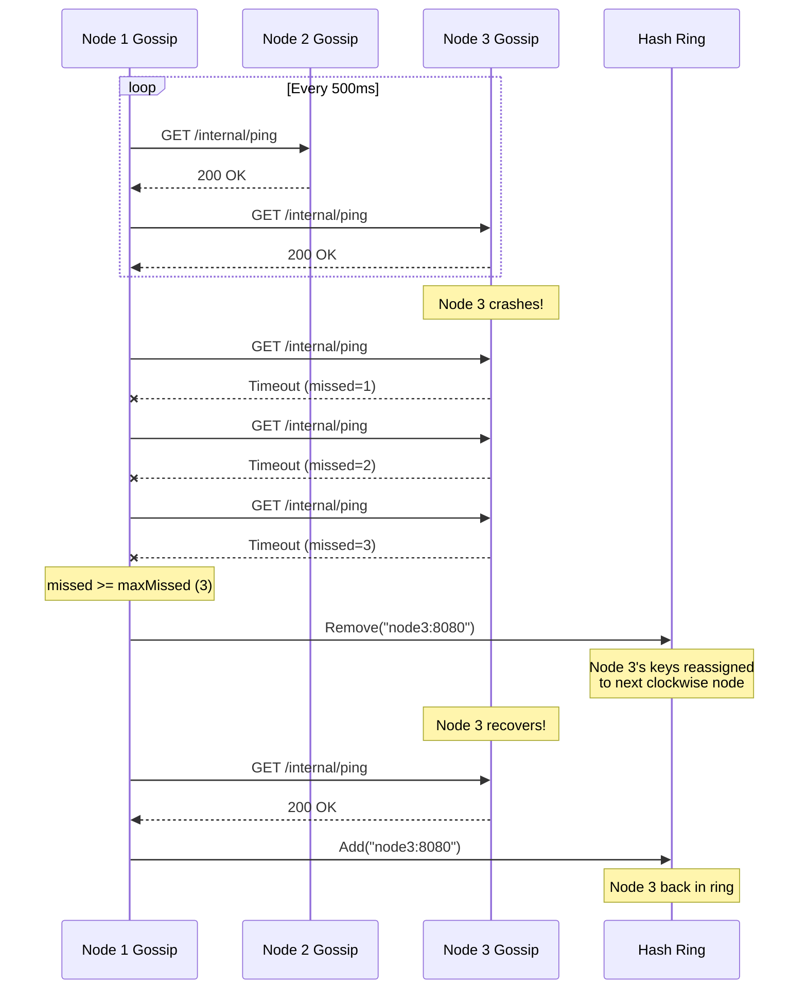
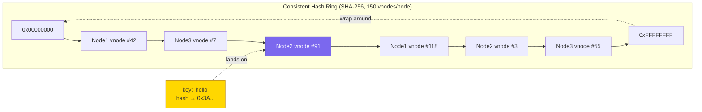
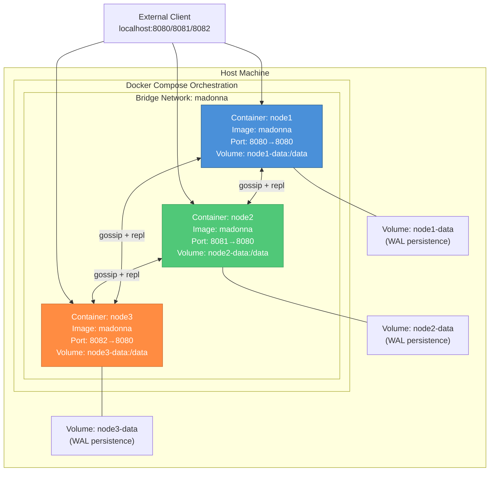
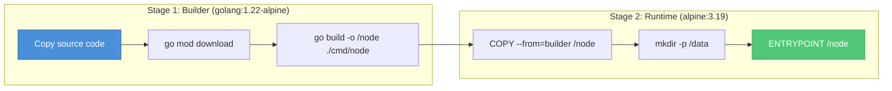
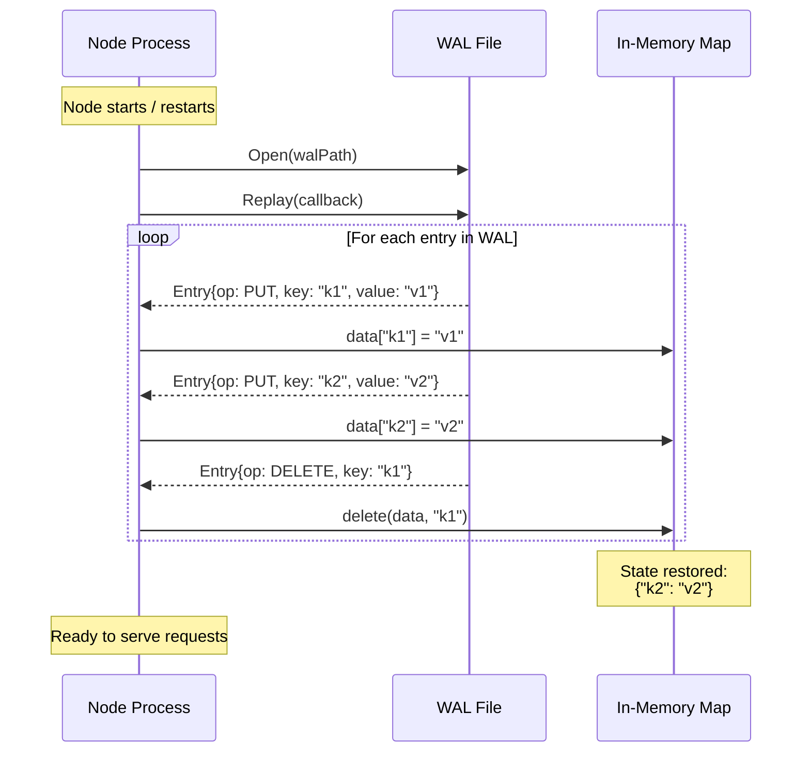

# Madonna — System Architecture & Workflow Diagrams

## 1. High-Level System Architecture

```mermaid
graph TB
    subgraph "Client Layer"
        CLI["CLI Client<br/>(cmd/cli)"]
        CURL["curl / HTTP Client"]
    end

    subgraph "Docker Network: madonna"
        subgraph "Node 1 (localhost:8080)"
            S1["HTTP Server"]
            CL1["Cluster Manager"]
            R1["Replicator"]
            ST1["Store (in-memory)"]
            W1["WAL (disk)"]
            G1["Gossip Monitor"]
            H1["Hash Ring"]
        end

        subgraph "Node 2 (localhost:8081)"
            S2["HTTP Server"]
            CL2["Cluster Manager"]
            R2["Replicator"]
            ST2["Store (in-memory)"]
            W2["WAL (disk)"]
            G2["Gossip Monitor"]
            H2["Hash Ring"]
        end

        subgraph "Node 3 (localhost:8082)"
            S3["HTTP Server"]
            CL3["Cluster Manager"]
            R3["Replicator"]
            ST3["Store (in-memory)"]
            W3["WAL (disk)"]
            G3["Gossip Monitor"]
            H3["Hash Ring"]
        end
    end

    CLI --> S1
    CLI --> S2
    CLI --> S3
    CURL --> S1

    G1 <--> G2
    G1 <--> G3
    G2 <--> G3

    R1 --> S2
    R1 --> S3
    R2 --> S1
    R2 --> S3
    R3 --> S1
    R3 --> S2
```



---

## 2. Node Internal Layer Architecture

Each node is built as a **4-layer stack**. Dependencies only flow downward.



---

## 3. Write Flow (PUT /key/{key})



---

## 4. Read Flow (GET /key/{key})



---

## 5. Gossip Failure Detection



---

## 6. Consistent Hashing Ring



> **Key Insight**: Each real node gets **150 virtual positions** on the ring. When looking up a key, the system hashes the key with SHA-256, takes the first 4 bytes as a uint32, and finds the **first virtual node clockwise** from that position. This ensures even distribution and minimal key remapping when nodes join/leave.

---

## 7. Docker Deployment Topology



### Docker Build Process (Multi-stage)



---

## 8. WAL Crash Recovery Flow



### WAL Entry Format

```
┌──────────────────┬────────────────────────────────────────┐
│  4 bytes (BE)    │  JSON payload + newline                │
│  Length Prefix   │  {"op":"PUT","key":"k1","value":"v1"}\n│
└──────────────────┴────────────────────────────────────────┘
```

---

## 9. Environment Variables & Configuration

| Variable | Purpose | Example |
|---|---|---|
| `MADONNA_ADDR` | This node's address (host:port) | `node1:8080` |
| `MADONNA_PEERS` | Comma-separated peer addresses | `node2:8080,node3:8080` |
| `MADONNA_WAL` | Path to WAL file | `/data/wal.log` |

---

## 10. API Endpoints Summary

### Public API (Client-facing)
| Method | Path | Description |
|---|---|---|
| `GET` | `/key/{key}` | Get value for key (proxies to owner if needed) |
| `PUT` | `/key/{key}` | Set value for key (body = value) |
| `DELETE` | `/key/{key}` | Delete key |

### Internal API (Node-to-node)
| Method | Path | Description |
|---|---|---|
| `GET` | `/internal/ping` | Gossip heartbeat liveness check |
| `POST` | `/internal/replicate` | Receive replicated write operation |
| `GET` | `/internal/status` | Cluster liveness state (JSON) |
